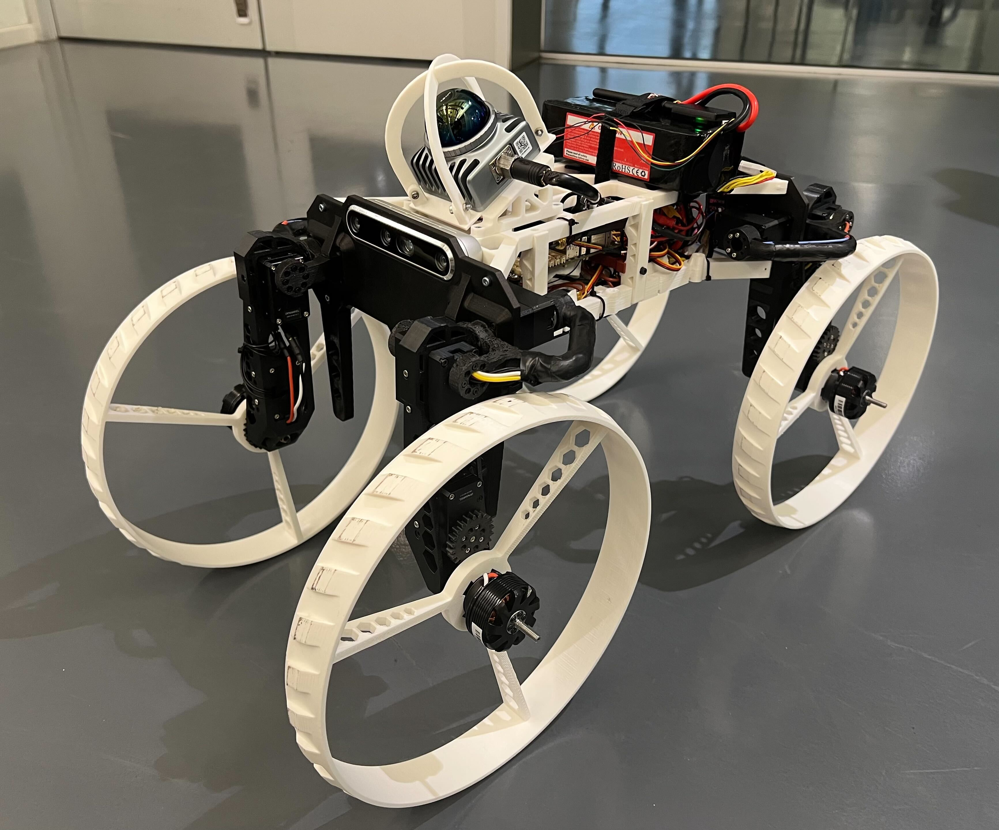

# M4 Firmware (ROS2)

ROS2 firmware for the **M4 morphing robot** — a platform capable of switching between wheeled ground driving, legged postures, and quadcopter flight.  
Runs on **Jetson Orin** + **Cube Orange / PX4** or  **Jetson_ARK / Holybro** , communicating via DDS (no MAVROS required).


> Detailed documentation: [`doc/`](doc/)  
> Full setup guide: [`doc/Robot_Setup_Note/whitem4_jetson_setup_note.txt`](doc/Robot_Setup_Note/whitem4_jetson_setup_note.txt)  
> Controller structure & flow: [`doc/firmware_structure/README.md`](doc/firmware_structure/README.md)

<p align="center">
  
</p>

---

## Quick Start（On Jetson）

### 0. assemable the robot

### 1. Clone repo
！！ follow doc/Robot_Setup_Note/whitem4_jetson_setup_note.txt for details ！！

```bash
git clone --recursive git@github.com:Taoran2023/m4-firmware-ros2.git whiteM4_ros2/m4-firmware-ros2
cd whiteM4_ros2/m4-firmware-ros2

# Switch submodule to ros2 branch
cd m4_home/m4_ws/src/m4-firmware
git switch ros2
cd ~/whiteM4_ros2/m4-firmware-ros2
```

### 2. Build

```bash
cd m4_home/m4_ws
source /opt/ros/humble/setup.bash
colcon build --symlink-install
```

### 3. Run

```bash
# Start node directly
source m4_home/m4_ws/install/setup.bash
ros2 launch m4_firmware m4_control.launch.py

# Or use the startup script (creates a tmux session named "control")
./startup.sh
tmux attach -t control
```

### 4. Sync (Git Workflow)
working on laptop, build onn Jetson

```bash
./host_sync.sh              # pull latest + update submodule
./host_push.sh "commit msg" # commit & push all changes
./jetson_sync.sh            # run on Jetson to pull updates
```

---

## Robot Modes & RC Control

The robot is controlled via an RC transmitter through PX4. All channels are configurable in `config/rc_channel_config.yaml`.

### Default Channel Mapping

| Channel | Switch | States |
|---|---|---|
| Ch6 | Arm | Low = DISARM / Mid = GROUND ARM / High = AERIAL ARM |
| Ch8 | UAV mode | Low = Drive / High = UAV transform |
| Ch9 | Drive mode | Low = STAND / Mid = CROUCH1 / High = CROUCH2 |
| Ch10 | AUTO mode | Low = MANUAL / Mid+High = AUTO |
| Ch2 | X velocity (joystick) | — |
| Ch1 | Y velocity (joystick) | — |

### Mode Configurations

| Mode | Description |
|---|---|
| STAND | Nominal driving posture, saggital joints at 0° |
| CROUCH1 | Lowered posture, saggital joints at 40° |
| CROUCH2 | Further lowered, saggital joints at 80° |
| SIT | Resting posture on landing gear, saggital joints at 90° |
| UAV | Arms folded out for quadcopter flight, frontal joints at 90° |

### Manual Mode Operation Flow

```
DISARM (Ch6 low)
  → GROUND ARM (Ch6 mid):
        Ch9 → switch drive posture (STAND / CROUCH1 / CROUCH2)
        Ch2 / Ch1 → joystick velocity control
        Ch8 high → trigger G2A/UAV transform (stops wheels first)
  → AERIAL ARM (Ch6 high):
        Safety interlock: if not in UAV config → force DISARM
        If in UAV config → PX4 handles arming
```

---

## AUTO Mode Topic Interface

When Ch10 is in AUTO position, RC joystick is replaced by software topics.  
RC DISARM (Ch6 low) always overrides AUTO mode.

### Prerequisites — Localization Source

AUTO aerial mode requires a continuous `nav_msgs/Odometry` stream. Two sources are supported:

| Source | Package | Default topic | `odom_source` value |
|---|---|---|---|
| LiDAR-Inertial | [FAST-LIO2](https://github.com/hku-mars/FAST_LIO) | `/Odometry` | `"fastlio"` |
| Motion Capture | [vrpn_mocap](https://github.com/alvinsunyixiao/vrpn_mocap) (ROS2) | `/vrpn_mocap/<body>/pose` | `"mocap"` |

Configure the active source in `config/robot_config.yaml` → `auto_mode.odom_source` and `auto_mode.odom_topic`.

### Subscribed Topics (inputs to the controller)

| Topic | Type | Description |
|---|---|---|
| `/auto/mode_cmd` | `custom_msgs/M4ModeCmd` | Target mode: 0=STAND 1=UAV 2=CROUCH1 4=CROUCH2 |
| `/auto/waypoint` | `geometry_msgs/PoseStamped` | Aerial position setpoint (ENU frame) |
| `/auto/cmd_vel` | `geometry_msgs/Twist` | Ground velocity command (linear.x, angular.z) |
| `/localization/odom` | `nav_msgs/Odometry` | Visual odometry input (FastLIO or MoCap) |

### Published Topics (outputs from the controller)

| Topic | Type | Description |
|---|---|---|
| `/fmu/in/vehicle_command` | `px4_msgs/VehicleCommand` | ARM / DISARM / mode switch to PX4 |
| `/fmu/in/offboard_control_mode` | `px4_msgs/OffboardControlMode` | Offboard heartbeat (10 Hz) |
| `/fmu/in/trajectory_setpoint` | `px4_msgs/TrajectorySetpoint` | Position or velocity setpoint (NED) |
| `/fmu/in/vehicle_visual_odometry` | `px4_msgs/VehicleOdometry` | Forwarded visual odom to PX4 EKF2 (NED) |

### AUTO Mode M4ModeCmd Values

```bash
# Switch to STAND
ros2 topic pub /auto/mode_cmd custom_msgs/msg/M4ModeCmd \
  "{header: {stamp: {sec: 0}}, mode: 0}" --once

# Switch to UAV (triggers G2A transform → 5s IMU settle → ARM)
ros2 topic pub /auto/mode_cmd custom_msgs/msg/M4ModeCmd \
  "{header: {stamp: {sec: 0}}, mode: 1}" --once

# Switch to CROUCH1
ros2 topic pub /auto/mode_cmd custom_msgs/msg/M4ModeCmd \
  "{header: {stamp: {sec: 0}}, mode: 2}" --once
```

### Offboard State Machine (AUTO AERIAL)

```
mode_cmd=1 sent
  → offboard heartbeat starts (PRE_ARM, 10 Hz)
  → wait 5 s for IMU to settle after G2A transform
  → check odom healthy
      YES → send ARM + OFFBOARD mode → TRACKING (position control)
      NO  → wait, retry when odom recovers
  → if odom lost during flight → DESCENDING (velocity, 0.3 m/s downward)
       recovery: restore odom + resend mode_cmd=1
```

---

## Configuration Files

| File | Description |
|---|---|
| `config/robot_config.yaml` | Joint IDs, calibration ticks, wheel params, AUTO mode params |
| `config/motor_config.yaml` | Dynamixel XM540-W270-R control table (do not modify) |
| `config/rc_channel_config.yaml` | RC channel mapping and PWM thresholds |

---

# Dev Know-How
Here are some of the main things to consider when using the robot:

* If you want `startup.sh` to be launched on startup, you need to put it into /etc/rc.local which runs everytime the Nvidia Jetson Orin boots up. It launches a tmux session named `control` **using sudo**. 
If the user wishes to see the information provided from the `m4_control.launch.py` script running in the tmux session, they must call `sudo tmux attach -t control`.
Sudo is necessary every time tmux is called. For example when looking for active sessions the user must specify `sudo tmux ls`.

* To exit the control script `ssh` into the onboard computer, and run `sudo tmux send-keys -t control 'C-c'`. This should kill the m4_control.launch.py script, move the robot to sit configuration and switch off the servos.

* If you wish to re-launch after exit, without rebooting: unplug and re-plug the Pixhawk USB before re-launching. Then: `sudo tmux send-keys -t control 'ros2 launch m4_firmware m4_control.launch.py' Enter`

# General debugging FAQ
  * Devices that need to be connected are Pixhawk and U2D2. They should show up in /dev/ as `/dev/pixhawk` and `/dev/U2D2` if the udev setup rules (`setup_scripts/set_udev_rules.sh`) have been set up correctly and if there is no hardware fault.
  * If you don't see the devices either the device is not configured correctly or the USB connection is at fault.
  * If you are unable to connect to the robot, power on the Jetson and plug in a monitor (before boot), a mouse, and a keyboard in order to set up the computer from the Ubuntu GUI.
  * If the robot controllers are not running or something is faulty, all error messages are in the tmux running terminal, accessible via `sudo tmux attach -t control`.
  * If the tmux terminal isn't running, inspect `startup.sh` for potential faults.
