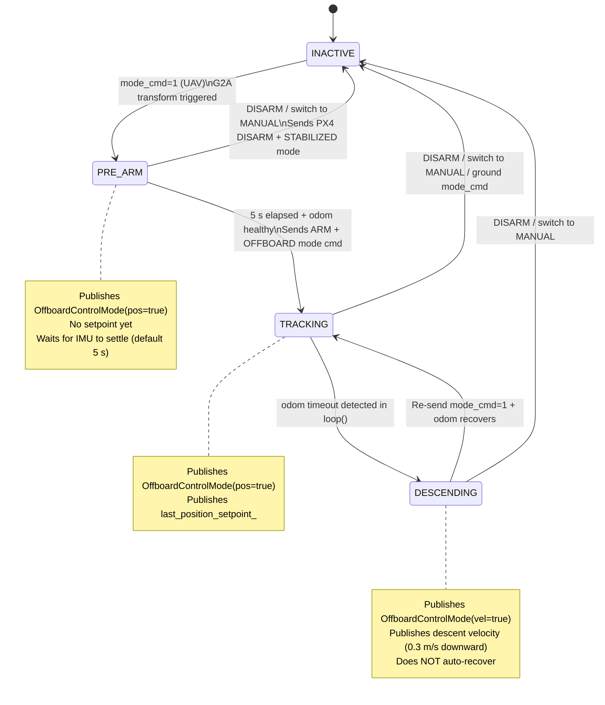
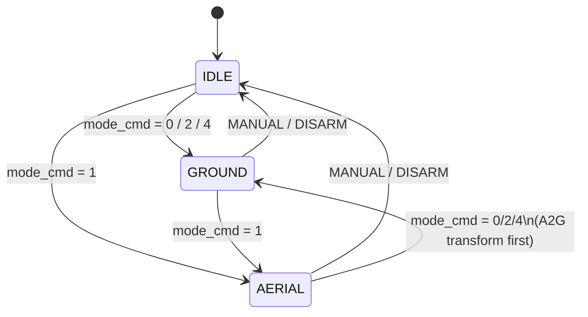

# M4 Firmware — Controller Structure & Flow

> Source files: `m4_controller_node.cpp`, `RCcontroller.h/cpp`, `M4Base`  
> Last updated: 2026-05-02 (all ground-mode tests passed)

---

## 1. System Architecture Overview

```
┌─────────────────────────────────────────────────────────────────┐
│                     Jetson Orin (ROS2 Humble)                   │
│                                                                  │
│  ┌──────────────────────────────────────────────────────────┐   │
│  │               M4ControllerNode (ROS2 Node)               │   │
│  │                                                          │   │
│  │  ┌──────────────┐   ┌──────────────┐  ┌──────────────┐ │   │
│  │  │ RCController │   │    loop()    │  │offboard_timer│ │   │
│  │  │  (50ms sub)  │   │    50ms      │  │    10Hz      │ │   │
│  │  └──────┬───────┘   └──────┬───────┘  └──────┬───────┘ │   │
│  │         │ RCstate          │                  │         │   │
│  │         └──────────────────┘        OffboardState       │   │
│  │                     │                         │         │   │
│  │              ┌──────▼──────┐                  │         │   │
│  │              │   M4Base    │◄─────────────────┘         │   │
│  │              │  (200Hz     │                             │   │
│  │              │  ctrl loop) │                             │   │
│  │              └─────────────┘                             │   │
│  └──────────────────────────────────────────────────────────┘   │
│                                                                  │
│  Subscribed topics:          Published topics:                   │
│  /fmu/out/input_rc      →   /fmu/in/vehicle_command             │
│  /fmu/out/vehicle_status    /fmu/in/vehicle_visual_odometry     │
│  /localization/odom     →   /fmu/in/offboard_control_mode       │
│  /auto/mode_cmd         →   /fmu/in/trajectory_setpoint         │
│  /auto/waypoint                                                  │
│  /auto/cmd_vel                                                   │
└─────────────────────────────────────────────────────────────────┘
          │ U2D2 Serial (2 MHz)       │ USB (MAVLink)/ Jetson_ARK connection
          ▼                           ▼
   12x Dynamixel Servos         Cube Orange / PX4
   (8 joints + 4 wheels)        (Flight controller + ESC + IMU)
```

---

## 2. Core Components

### 2.1 M4Base — Hardware Abstraction Layer

- **Rate**: dedicated thread at 200 Hz
- **Responsibilities**: Dynamixel Protocol 2.0 communication, synchronised joint/wheel control, morphology state machine
- **API**: `stand()` `sit()` `crouch1()` `crouch2()` `uav()` `drive(x, w)` `get_current_configuration()`
- All commands are **non-blocking** (pushed into an internal queue). The caller polls `get_current_configuration()` to detect completion.

### 2.2 RCController

- **Mechanism**: subscribes to `/fmu/out/input_rc`, parses PWM values into `RCstate`
- **Config source**: `rc_channel_config.yaml` (channel IDs + PWM thresholds)
- **Output**: `RCstate` struct, protected by an `std::atomic<bool>` availability flag

### 2.3 M4ControllerNode

- **Timer 1** — `loop()`: 50 ms, main control loop
- **Timer 2** — `offboard_timer_`: 100 ms (10 Hz), independent PX4 offboard heartbeat. Runs regardless of `loop()` state, guaranteeing the >2 Hz PX4 requirement even during blocking init or early-return paths.

---

## 3. RCstate Structure

```cpp
struct RCstate {
    ArmSwitchState        arm_switch_state;       // Ch6:  DISARM / GROUND_ARM / AERIAL_ARM
    AutoSwitchState       auto_switch_state;       // Ch10: MANUAL / AUTO  (all 3 positions map)
    UAVSwitchState        uav_switch_state;        // Ch8:  UAV_DISABLE / UAV_TRANSFORM
    DriveSwitchState      drive_switch_state;      // Ch9:  STAND / CROUCH1 / CROUCH2
    VelocityJoystickState velocity_joystick_state; // Ch1/Ch2: normalised to [-1, 1]
};
```

**AUTO switch mapping (3-position switch, Option C):**

| PWM | State |
|---|---|
| 1094 (low) | MANUAL |
| 1514 (mid) | AUTO |
| 1934 (high) | AUTO |

Both mid and high positions activate AUTO mode; low returns to MANUAL.

---

## 4. OffboardState Machine

Drives the 10 Hz heartbeat timer. Completely decoupled from `loop()`.



---

## 5. AUTO Mode Sub-states



**Per-state execution (every 50 ms):**

| Sub-state | Action |
|---|---|
| `IDLE` | No output |
| `GROUND` | `cmd_vel` fresh → `m4->drive(x, w)` ; timeout (0.5 s) → `drive(0, 0)` |
| `AERIAL` | Manages `OffboardState` transitions; updates `last_position_setpoint_` cache |

---

## 6. Main Control Loop — `loop()` (50 ms)

```
loop() — triggered every 50 ms
│
├─[pre] INIT check
│   m4_configuration == INIT → init_controller()
│       sit() → wait → stand() → wait
│       ⚠ Blocks loop(); offboard_timer_ keeps heartbeat alive independently
│
├─[pre] RC data check
│   rc_state_available == false → return  (no control output)
│
├─────────────────────────────────────────────────────────────────
│  [Priority ①]  RC DISARM  —  highest priority, always active
├─────────────────────────────────────────────────────────────────
│   arm_switch == DISARM
│       m4->drive(0, 0)
│       if offboard_state != INACTIVE:
│           send_arm_command(false)
│           send_stabilized_mode_command()    ← PX4 back to STABILIZED
│           offboard_state = INACTIVE
│       arm_pending_      = false
│       auto_mode_active  = false
│       auto_sub_state    = IDLE
│       prev_auto_switch  = MANUAL            ← allows immediate AUTO re-entry after re-arm
│       return
│
├─ Update m4_configuration from hardware
│
├─────────────────────────────────────────────────────────────────
│  [Priority ②]  AUTO switch detection
├─────────────────────────────────────────────────────────────────
│   MANUAL → AUTO edge detected (just_entered_auto):
│       arm_switch == AERIAL_ARM → reject, WARN, stay MANUAL
│       otherwise               → auto_mode_active=true
│                                  offboard_state=INACTIVE
│                                  arm_pending=false
│
│   AUTO → MANUAL (always permitted):
│       if offboard_state != INACTIVE:
│           send_arm_command(false)
│           send_stabilized_mode_command()
│           offboard_state = INACTIVE
│       arm_pending     = false
│       auto_mode_active = false
│
│   Update prev_auto_switch
│
├─ Odom health tick
│   if odom_healthy && (now − last_odom_time) > 0.5 s:
│       odom_healthy = false
│       if offboard_state == TRACKING → offboard_state = DESCENDING
│
├─────────────────────────────────────────────────────────────────
│  [Priority ③]  AUTO mode execution
├─────────────────────────────────────────────────────────────────
│   auto_mode_active == true
│   │
│   ├─ new mode_cmd → process_mode_cmd()
│   │
│   │   mode = 0 / 2 / 4  (ground):
│   │       if offboard_state != INACTIVE → DISARM + STABILIZED
│   │       if currently UAV config       → A2G transform (drive(0,0) + stand())
│   │       look up drive_mode_handler table → apply target configuration
│   │       auto_sub_state = GROUND
│   │
│   │   mode = 1  (UAV):
│   │       G2A transform if needed
│   │       offboard_state   = PRE_ARM
│   │       arm_pending      = true
│   │       arm_pending_since = now()
│   │       send_offboard_mode_command()    ← request OFFBOARD early
│   │       auto_sub_state = AERIAL
│   │
│   ├─ GROUND → execute_auto_ground()
│   │       cmd_vel fresh  → m4->drive(linear.x, angular.z)
│   │       cmd_vel timeout → m4->drive(0, 0)
│   │       ⚠ odom loss does NOT auto-stop; upstream planner is responsible
│   │
│   ├─ AERIAL → execute_auto_aerial()
│   │
│   │   if PRE_ARM or INACTIVE:
│   │       arm_pending && time < 5 s  → log remaining time, return
│   │       arm_pending && time ≥ 5 s  → arm_pending = false  (fall through)
│   │       odom_healthy               → send_arm_command(true)
│   │                                     offboard_state = TRACKING
│   │       !odom_healthy              → ERROR "waiting for odom"
│   │
│   │   if DESCENDING → return  (heartbeat timer handles descent)
│   │
│   │   if TRACKING:
│   │       waypoint fresh   → last_position_setpoint_ = latest_waypoint_
│   │       waypoint timeout → last_position_setpoint_ unchanged  (hover in place)
│   │
│   return   ← does NOT fall through to MANUAL logic
│
├─────────────────────────────────────────────────────────────────
│  [Priority ④]  MANUAL mode  —  original logic, unchanged
├─────────────────────────────────────────────────────────────────
│   arm_switch == GROUND_ARM:
│       uav_switch == UAV_DISABLE  (drive mode):
│           drive_mode_handler table → switch STAND / CROUCH1 / CROUCH2
│           m4->drive(rc.x_vel, rc.y_vel)
│
│       uav_switch == UAV_TRANSFORM  (UAV mode):
│           uav_mode_handler table → drive(0,0) then transform
│
│   arm_switch == AERIAL_ARM:
│       ⚠ Safety interlock: if m4_configuration != UAV → force DISARM every tick
```

---

## 7. Offboard Heartbeat Timer — `offboard_heartbeat_callback()` (10 Hz)

Runs independently from `loop()`. The 10 Hz rate provides a comfortable 5× margin above PX4's 2 Hz minimum requirement.

```
offboard_heartbeat_callback() — 100 ms period
│
├─ INACTIVE    → publish nothing
│
├─ PRE_ARM     → publish OffboardControlMode(position=true)
│                (no setpoint — only warms up PX4 offboard stream)
│
├─ TRACKING    → publish OffboardControlMode(position=true)
│                publish TrajectorySetpoint(last_position_setpoint_)
│                  position already converted ENU→NED
│
└─ DESCENDING  → publish OffboardControlMode(velocity=true)
                 publish TrajectorySetpoint(vx=0, vy=0, vz=+descent_rate)
                 ERROR log throttled at 2 s
```

---

## 8. Odometry Forwarding — `odom_callback()`

```
/localization/odom  (nav_msgs/Odometry — ROS ENU/FLU frame)
        │
        ▼  odom_callback()
┌──────────────────────────────────┐
│  ENU/FLU  →  NED/FRD conversion  │
│                                  │
│  position:    (y,  x,  −z)       │
│  quaternion:  (w, qy, qx, −qz)   │
│  velocity:    (vy, vx, −vz)      │
│  angular vel: (wx, −wy, −wz)     │
│  timestamp:   nanoseconds / 1000 │
│               → PX4 microseconds │
└──────────────────┬───────────────┘
                   │
      odom_source == "fastlio"  →  /fmu/in/vehicle_visual_odometry
      odom_source == "mocap"    →  /fmu/in/vehicle_mocap_odometry

Side effects:
  last_odom_time_ = now()
  odom_healthy_   = true
```

---

## 9. Morphology Transition Handler Tables

Implements the Strategy pattern via member-function pointers. Adding a new configuration requires only a new table entry — no logic changes.

```cpp
// Ground mode transitions
drive_mode_transition_handler = {
    { STAND,   STAND,   "Move to stand",   &M4Base::stand   },
    { CROUCH1, CROUCH1, "Move to crouch1", &M4Base::crouch1 },
    { CROUCH2, CROUCH2, "Move to crouch2", &M4Base::crouch2 },
};

// UAV mode transitions
uav_mode_transition_handler = {
    { UAV_DISABLE,   UAV, "Move to stand", &M4Base::stand },
    { UAV_TRANSFORM, UAV, "Move to uav",   &M4Base::uav   },
};
```

**Trigger condition:**
```
rc_state.switch == handler.state  &&  m4_configuration != handler.configuration
```
At most one handler fires per tick (break after first match).

---

## 10. Key Configuration Parameters

| File | Parameter | Default | Description |
|---|---|---|---|
| `robot_config.yaml` | `auto_mode.odom_source` | `"fastlio"` | Odometry source (`fastlio` / `mocap`) |
| `robot_config.yaml` | `auto_mode.odom_topic` | `"/fastlio/odom"` | Subscribed odom topic |
| `robot_config.yaml` | `auto_mode.odom_timeout_s` | `0.5` | Odom / cmd_vel staleness threshold (s) |
| `robot_config.yaml` | `auto_mode.odom_lost_descent_mps` | `0.3` | Descent speed when odom lost in flight (m/s) |
| `robot_config.yaml` | `auto_mode.uav_arm_wait_s` | `5.0` | Wait after G2A transform before sending ARM (s) |
| `rc_channel_config.yaml` | `auto_mode.channel_id` | `10` (TBD) | RC channel for AUTO switch |

---

## 11. Known Limitations & Design Decisions

| Item | Rationale |
|---|---|
| Ground mode does not auto-stop on odom loss | By design — differential drive is open-loop. The upstream planner stops publishing `/auto/cmd_vel`; cmd_vel timeout (0.5 s) then stops the robot. |
| DESCENDING does not auto-recover | Prevents unexpected mode switches. Operator must confirm odom is healthy and re-send `mode_cmd=1`. |
| 5 s ARM delay after G2A transform | Prevents ARM failure caused by IMU bias drift or high CPU load immediately after joint motion. Configurable via `uav_arm_wait_s`. |
| PRE_ARM sends no position setpoint | Only the heartbeat is sent; PX4 accepts the offboard stream but does not execute position control until TRACKING. |
| MANUAL AERIAL_ARM safety interlock | If `m4_configuration != UAV`, a DISARM command is sent to PX4 every tick — independent of AUTO mode state. |

---

## 12. Roadmap

- [ ] Ground bimodel controller integration (waypoint tracking → publish `/auto/cmd_vel`)
- [ ] PX4 aerial tuning (position and velocity loop gains)
- [ ] DESCENDING mode flight test and descent rate calibration
- [ ] FastLIO z-axis drift characterisation (must be resolved before aerial mode)
